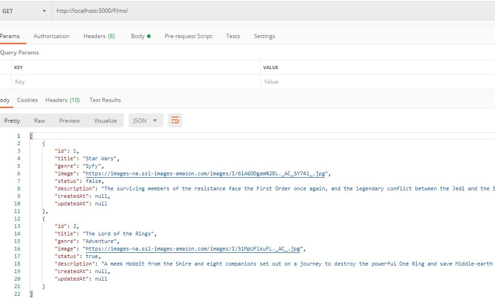

# **AlquiNetflixBack**
---

proyecto alojado en: [Pulsa aqui para accedet al repositorio](https://github.com/davidmorenocapel/AlquiNetflixBack) (en dos ramas, master y develop)

Este es el backend del proyecto de "Classic Netflix", una web para alquiler de películas, con información de las mismas y posibilidad de registro de usuarios.


## Tecnologías usadas e instalación

* express
* mysql2
* nodemon
* sequelize
* bcryptjs
* cors
* jsonwebtoken

> npm i

ejecuta este comando tras la descarga o clonación para que el proyecto funcione en tu máquina

## Diseño del backend (modelos)

Los datos se distribuyen en 4 tablas: FILMS, USERS, ORDERS (resultante de la relacion entre FILMS y USERS de muchos a muchos) y TOKENS (necesaria para la creacion y almacenamiento de los tokens de usuario para el login de las sesiones).


## Uso de SEQUELIZE para las consultas a la base de datos y envio al frontend (vistas y controladores)

Raíces de las rutas para los endpoints necesarios en el front

```
app.use('/films', require('./routes/films'));

app.use('/users', require('./routes/users'));

app.use('/orders', require('./routes/orders'));
```

Ejemplos /USERS:

router.get('/', usersController.usersList);


Ejemplo con modificacion de usuarios:

Ejemplo con TOKEN, y su codigo de codificacion de la contraseña:

>router.post('/login', usersController.login);

```
async login(req,res){
    try {const user = await User.findOne({
            where:{
                email:req.body.email,
            }
        });
            if(!user){
                return res.status(400).send({message:"Email o contraseña incorrectos"})
            }
        const isMatch = await bcrypt.compare(req.body.password,user.password)
            if(!isMatch){
                return res.status(400).send({message:"Email o contraseña maaaaaaaaaaaaaal"})
            } 
            const token = jwt.sign({id:user.id}, 'TuClaveAquiLadron' , {expiresIn:'2w'} );
            Token.create({token,UserId:user.id});
            res.send({message:`welcome ${user.name}` , user,token});
        }
         catch(error) {
            console.log(error)
            res.status(200).send({mensaje: 'Usuario creado'})
           } 
    },
```

>router.put('/edit/:id', usersController.editUser);


Ejemplo con FILMS:

>router.get('/', pageController.filmsList);



---

## **Autores**

[David  Moreno](https://github.com/davidmorenocapel)

[Iñigo Vadillo](https://github.com/Vadithalion)